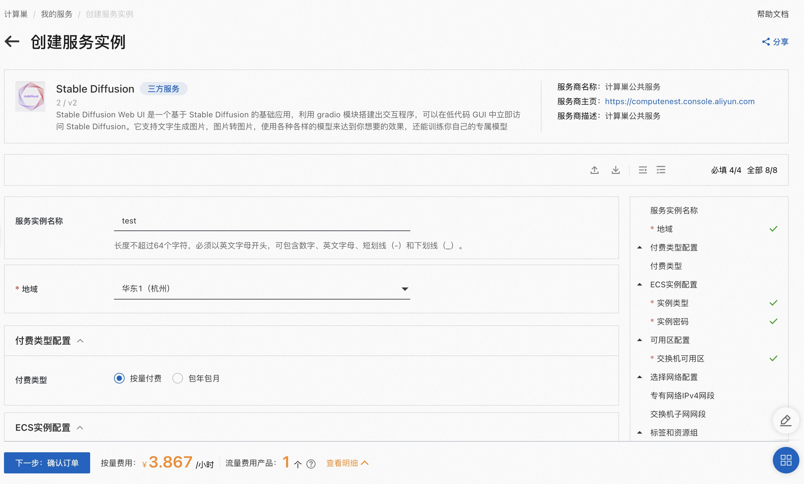

# stable-diffusion服务实例部署文档

>**免责声明：**本服务由第三方提供，我们尽力确保其安全性、准确性和可靠性，但无法保证其完全免于故障、中断、错误或攻击。因此，本公司在此声明：对于本服务的内容、准确性、完整性、可靠性、适用性以及及时性不作任何陈述、保证或承诺，不对您使用本服务所产生的任何直接或间接的损失或损害承担任何责任；对于您通过本服务访问的第三方网站、应用程序、产品和服务，不对其内容、准确性、完整性、可靠性、适用性以及及时性承担任何责任，您应自行承担使用后果产生的风险和责任；对于因您使用本服务而产生的任何损失、损害，包括但不限于直接损失、间接损失、利润损失、商誉损失、数据损失或其他经济损失，不承担任何责任，即使本公司事先已被告知可能存在此类损失或损害的可能性；我们保留不时修改本声明的权利，因此请您在使用本服务前定期检查本声明。如果您对本声明或本服务存在任何问题或疑问，请联系我们。

## 概述
Stable Diffusion Web UI 是一个基于 Stable Diffusion 的基础应用，利用 gradio 模块搭建出交互程序，可以在低代码 GUI 中立即访问 Stable Diffusion。它支持文字生成图片，图片转图片，使用各种各样的模型来达到你想要的效果，还能训练自己的专属模型。本文向您介绍如何开通计算巢上的stable-diffusion服务，以及部署流程和使用说明。

## 计费说明
stable-diffusion在计算巢上的费用主要涉及：

- 所选vCPU与内存规格
- 磁盘容量
- 公网带宽

计费方式包括：

- 按量付费（小时）
- 包年包月

预估费用在创建实例时可实时看到。

## 部署架构
stable-diffusion服务单机部署架构。

## RAM账号所需权限
stable-diffusion服务需要对ECS、VPC等资源进行访问和创建操作，若您使用RAM用户创建服务实例，需要在创建服务实例前，对使用的RAM用户的账号添加相应资源的权限。添加RAM权限的详细操作，请参见[为RAM用户授权](https://help.aliyun.com/document_detail/121945.html)。所需权限如下表所示。

| 权限策略名称 | 备注 |
| --- | --- |
| AliyunECSFullAccess | 管理云服务器服务（ECS）的权限 |
| AliyunVPCFullAccess | 管理专有网络（VPC）的权限 |
| AliyunROSFullAccess | 管理资源编排服务（ROS）的权限 |
| AliyunComputeNestUserFullAccess | 管理计算巢服务（ComputeNest）的用户侧权限 |
| AliyunCloudMonitorFullAccess | 管理云监控（CloudMonitor）的权限 |

## 部署流程
### 部署步骤
单击[部署链接](https://computenest.console.aliyun.com/user/cn-hangzhou/serviceInstanceCreate?ServiceId=service-7c7e05fc6d2b42929821)，进入服务实例部署界面，根据界面提示，填写参数完成部署。

### 部署参数说明
您在创建服务实例的过程中，需要配置服务实例信息。下文介绍stable-diffusion服务实例输入参数的详细信息。

| 参数组     | 参数项    | 示例           | 说明                       |
|---------|--------|--------------| --- |
| 服务实例名称  |        | test         | 实例的名称                    |
| 地域      |        | 华东1（杭州）      | 选中服务实例的地域，建议就近选中，以获取更好的网络延时。 |
| 可用区配置   | 部署区域   | 可用区I         | 地域下的不同可用区域               |
| 付费类型配置  | 付费类型   | 按量付费 或 包年包月  |
| ECS实例配置 | 实例类型   | ecs.gn6i-c4g1.xlarge | 实例规格，可以根据实际需求选择          |
| ECS实例配置 | 实例密码   | ********     | 设置实例密码。长度8~30个字符，必须包含三项（大写字母、小写字母、数字、()`~!@#$%^&*-+={}[]:;'<>,.?/ 中的特殊符号） |
| 网络配置    | 专有网络IPv4网段  | 192.168.0.0/16     | VPC的ip地址段范围 |
| 网络配置    | 交换机子网网段   | 192.168.0.0/24     | 交换机子网网段 |

### 验证结果

1. 查看服务实例。
服务实例创建成功后，部署时间大约需要2分钟。部署完成后，页面上可以看到对应的服务实例。

2. 通过服务实例访问stable-diffusion

进入到对应的服务实例后，可以在页面上获取到Endpoint以访问服务。

### 帮助文档
请访问[stable-diffusion使用文档](https://github.com/wangwangbobo/stable-diffusion-webui)了解如何使用。
